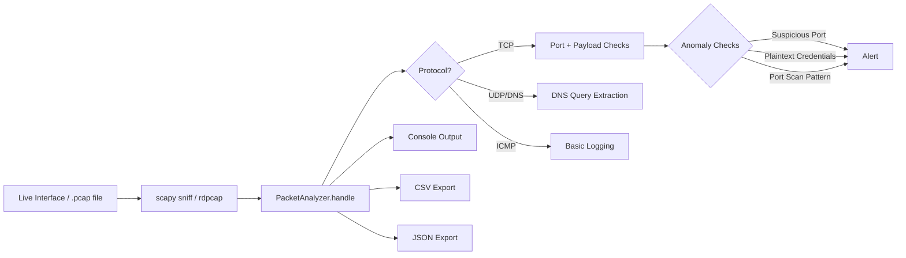

# BankWatch — Network Traffic Visibility & Anomaly Sniffer

> CodeAlpha Cyber Security Internship — Task 1: Basic Network Sniffer
> Built and extended by **Amantle Maakelo**

A Python-based packet sniffer that captures live network traffic, breaks it
down by protocol, and flags security-relevant anomalies in real time. Rather
than treat this as a toy packet-printer, this project is framed and extended
as a **lightweight network visibility tool for a financial-services
environment** — the kind of first-pass instrumentation a SOC analyst might
use before traffic is forwarded to a full SIEM.

## Why this framing

Banking and financial networks are high-value targets, and a large share of
real-world incidents start with something mundane: a legacy service left on
an insecure port, a login form still submitting over plaintext HTTP, or a
scan sweeping a subnet looking for an opening. This tool is built to catch
exactly those patterns, and to output data in a format (CSV/JSON) that
mirrors how detection tools feed data into a SIEM for correlation.

## Features

- **Live packet capture** via `scapy`, or offline analysis of `.pcap` files
- **Protocol breakdown**: Ethernet / IP / TCP / UDP / ICMP / DNS, with
  source/destination IP, ports, and payload length
- **Anomaly detection**, tuned for common early-stage attack indicators:
  | Detection | Why it matters |
  |---|---|
  | Plaintext credentials in HTTP payloads | Login/password data sent unencrypted is instantly harvestable by anyone on the network path |
  | Traffic to known-risky ports (Telnet, FTP, SMB, RDP, MS-RPC) | These services are common entry points for lateral movement and ransomware |
  | Port-scan heuristic (many distinct ports from one source in a short window) | Classic reconnaissance behavior that typically precedes a targeted attack |
- **Structured export** to CSV and JSON for downstream analysis or SIEM ingestion
- **BPF filtering** (e.g. `--filter "tcp port 80"`) to scope live captures
- Works entirely offline against a bundled **synthetic sample capture**, so
  reviewers can see it work without needing root privileges or a live network

## Architecture



## Project structure

```
CodeAlpha_NetworkSniffer/
├── README.md
├── requirements.txt
├── src/
│   ├── sniffer.py                 # main application
│   └── generate_sample_pcap.py    # builds the bundled demo capture
├── samples/
│   ├── demo_traffic.pcap          # synthetic sample traffic (safe to run offline)
│   ├── sample_capture_log.csv     # example CSV output
│   ├── sample_capture_log.json    # example JSON output
│   └── sample_console_output.txt  # example console run
├── docs/
│   └── FINDINGS.md                # write-up: what the tool caught and why it matters
└── screenshots/
```

## Installation

```bash
git clone https://github.com/amantlemaakelo/CodeAlpha_NetworkSniffer.git
cd CodeAlpha_NetworkSniffer
pip install -r requirements.txt
```

## Usage

### Option 1 — Analyze the bundled sample capture (no privileges needed)

```bash
cd src
python3 sniffer.py -r ../samples/demo_traffic.pcap
```

### Option 2 — Live capture (requires admin/root privileges)

```bash
sudo python3 sniffer.py -i eth0 --filter "tcp or udp"
```

### Option 3 — Capture a fixed number of packets and export

```bash
sudo python3 sniffer.py -i eth0 -c 100 --csv logs/capture.csv --json logs/capture.json
```

### Regenerating the sample capture

```bash
cd src
python3 generate_sample_pcap.py
```

## Sample output

```
[TCP  ]       10.0.1.30:52000  -> 10.0.2.5       :23     len=54
   [ALERT] Suspicious port: Telnet (unencrypted remote admin)
[TCP  ]       10.0.1.22:51000  -> 172.16.0.20    :80     len=193
   [ALERT] Possible plaintext credentials in HTTP payload
[TCP  ]       10.0.1.99:43252  -> 10.0.2.10      :22     len=54
   [ALERT] Possible port scan from 10.0.1.99 (>= 8 ports in 10s)

============================================================
Capture Summary
============================================================
    total_packets: 31
              tcp: 28
              udp: 3
             icmp: 0
              dns: 3
           alerts: 11
============================================================
```

Full sample run: [`samples/sample_console_output.txt`](samples/sample_console_output.txt)

## What this demonstrates

- Understanding of the TCP/IP stack and how to programmatically parse it
- Practical application of `scapy` for both live capture and offline `.pcap` analysis
- Security-analyst thinking: translating raw packet data into *actionable* alerts
- Data engineering habits: structured, exportable output rather than
  print-and-forget scripting
- Communicating findings clearly (see [`docs/FINDINGS.md`](docs/FINDINGS.md))

## Limitations & next steps

- Anomaly detection is heuristic/rule-based, not ML-driven — a natural next
  step is anomaly scoring based on baseline traffic behavior
- HTTPS/TLS payloads are opaque by design; a production tool would pair this
  with TLS metadata analysis (JA3 fingerprinting) rather than payload inspection
- The port-scan heuristic is intentionally simple; Task 4 (Network IDS with
  Suricata/Snort) in this same repo series builds on this with proper rule-based detection

## Legal & ethical note

This tool is built and demonstrated using **synthetic, locally-generated
traffic only**. Live packet capture should only ever be run on networks you
own or have explicit authorization to monitor. Unauthorized packet capture
may violate computer misuse laws in most jurisdictions.

## Author

**Amantle Maakelo** — 
Pivoting into Cybersecurity & SAP 
[GitHub](https://github.com/amantlemaakelo)
